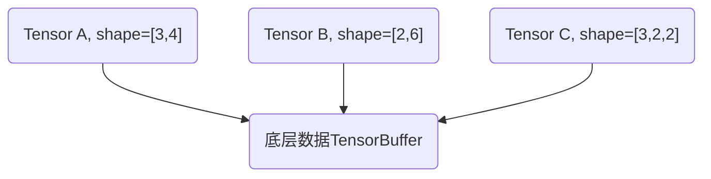
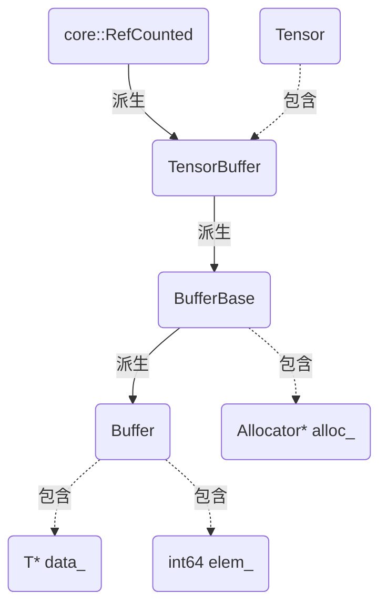
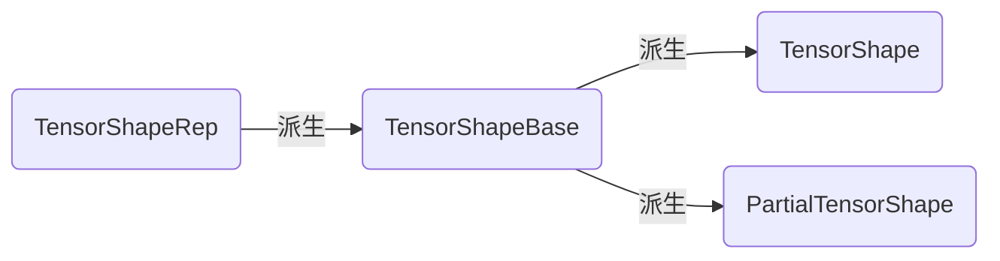
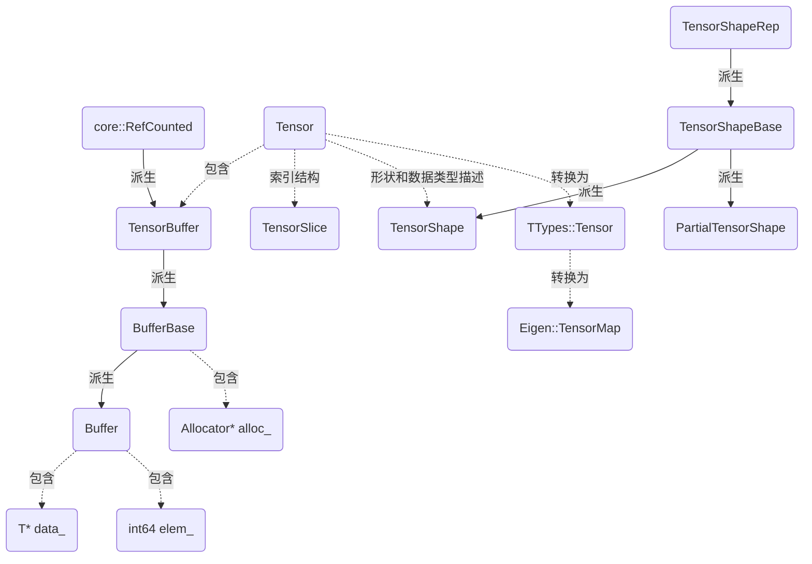

# 目录
1. 什么是tensor
2. tensor继承体系
3. 与Eigen3库的关系
4. 什么是tensor_reference
5. tensor_shape
6. tensor_slice
7. 其它结构
8. 关系图
9. 涉及的文件
10. 迭代记录

# 1. 什么是tensor
TF全称叫做TensorFlow，可见tensor的重要性。它本质上是一个对高维数据的封装，提供了丰富的API。在线性代数中，我们常用向量、矩阵来表示数据，而在深度学习应用中，有对更高维数据的需求。比如在对图像进行处理时，彩色图像本身就带有三维的信息（长、宽、颜色通道），通常还需要对彩色图像进行批处理，这样待处理的数据变为四维，在一些特殊的情形下，往往还需要更高维度的数据。如果针对每种多维数据定义一种结构，必然给计算带来不便。TF的做法是，为高维数据定义统一的类型Tensor。

但高维数据的概念有点抽象，为了让大家能对Tensor内部的数据结构有个直观的印像，我们先看一下Tensor类的私有数据成员：
```
class Tensor {
    //...
  private:
    TensorShape shape_;
    TensorBuffer* buffer_;
}
```
这两个结构都没有见过，不过没关系，只把它们当做张量的形状和底层数据指针就好了。Tensor作为一个核心数据类，必然提供了很多API，比如常规的构造、析构、赋值、复制、数值属性获取等。除此之外，还提供了两类比较特殊的接口，我们举例说明：
```
class Tensor {
  public:
    //...
    //与proto数据的相互转化
    bool FromProto(const TensorProto& other);
    void AsProtoField(TensorProto* proto);
    //为底层数据创建新视图
    template <typename T> typename TTypes<T>::Vec vec();
    template <typename T> typename TTypes<T>::Matrix matrix();
    template <typename T> typename TTypes<T, NDIMS>::Tensor tensor();
}
```
其中第一类将Tensor与序列化的proto之间相互转化，便于在设备之间传递Tensor。第二类是为当前的Tensor的底层数据提供另外一种视图，我们重点来说一下视图的概念。

回顾Tensor包含的私有数据，`TensorBuffer* buffer_`是一个指向底层数据的指针，关于它的结构在下文中会详细说明。这意味着，Tensor并不包含实际的底层数据，它实际上只是对底层数据的一种视图。同样一份底层数据，可以提供多种视图。比如对于一个长度为12的数组，如果把它看做向量，它是一个1x12的向量，如果把它看作矩阵，可以认为是3x4或者2x6的矩阵，如果把它当作张量，可以认为是3x2x2的张量。通过这种方法，我们可以对同一份底层数据进行复用，避免了重复申请内存空间，提升了效率。

顺便提一句，numpy中对多维数组的实现，也是同样的原理。

细心的读者可能发现了，在对底层数据创建新视图时，返回了一种奇怪的数据类型`typename TTypes<T>::Vec`，这涉及TF中的Tensor与Eigen3库的关系，我们将在下文中详细说明。

# 2. tensor继承体系
接下来我们看一下TensorBuffer到底是什么样的结构。它只是一个继承自引用计数类的虚拟接口，不包含任何实现：
```
class TensorBuffer : public core::RefCounted {
    //...
}
```
因此怀疑，TensorBuffer只是一个提供接口的基类，实际上能用的只是它的子类。我们看下它的继承结构：
```
class BufferBase : public TensorBuffer {
    //...
}
class Buffer : public BufferBase {
    //...
  private:
    T* data_;
    int64 elem_;
}
```
结构已经非常清晰了，BufferBase类继承自TensorBuffer，它除了包含一个内存分配器指针外，还对基类中的部分API进行了实现。而Buffer类是实际可用的，它包含了指向实际数据的指针data_以及元素数量elem_。

另外还要说明一点，Buffer除了申请内存之外，还能调用目标类的构造和析构函数，初始化Buffer的内容，TF为此设计了很多辅助类和函数，这里就不一一赘述了。

Tensor的继承体系图如下：


# 3. 与Eigen3库的关系
刚才提到了，当为Tensor的数据提供不同视图的时候，返回了一种奇怪的数据`TTypes<T>::Vec`，这种数据为TF中的Tensor和Eigen3库中的Tensor建立了联系。我们在tensor_types.h文件中，找到了这种类型的定义：
```
struct TTypes {
    typedef Eigen::TensorMap<Eigen::Tensor<T,NDIMS,Eigen::RowMajor,IndexType>,Eigen::Aligned> Tensor;
    typedef Eigen::TensorMap<Eigen::Tensor<T,1,Eigen::RowMajor,IndexType>,Eigen::Aligned> Vec;
    //...
}
```
原来，对Eigen3库中Tensor的使用在这里。由于这种定义被包裹在TTypes结构体中，所以不会与外部TF自定义的Tensor造成冲突。

重新回到Tensor的定义，我们发现，原来在对Tensor底层数据提供多种视图的时候，返回的已经不是Tensor结构，而是TTypes::TensorMap，这是否意味着，TF中定义的Tensor只是对Eigen::Tensor的一种封装呢？我们追根溯源，找到vec函数的实现：
```
template <typename T>
typename TTypes<T>::Vec vec() {
    return tensor<T,1>();
}

template <typename T, size_t NDIMS>
typename TTypes<T, NDIMS>::Tensor Tensor::tensor() {
    CheckTypeAndIsAligned(DataTypeToEnum<T>::v());
    return typename TTypes<T, NDIMS>::Tensor(base<T>(), shape().AsEigenDSizes<NDIMS>());
}
```
跟我们预想的完全一样，在对vec函数的调用中，调用了tensor函数，而这个函数的作用，就是将TF中定义的Tensor转变为TTypes::Tensor，而后者就是Eigen::TensorMap，也就是说，tensor返回的本质上是一个Eigen::TensorMap。另外，我们知道base()和shape()两个函数，分别返回了TensorBuffer指针和TensorShape，因此实际上就是使用TF中Tensor存储的数据，作为了Eigen::TensorMap的构造函数的参数。

可以说，TF中的Tensor实际上是对Eigen::TensorMap的一种高级封装，它不是简单的在私有数据成员包含后者，而是包含了构造后者所需要的数据，在需要后者的时候，构造并返回。这种方式，使得TF中的Tensor既能利用Eigen高效的张量计算方法，也能为Tensor定制一些API。

# 4. 什么是tensor_reference
Tensor类的对象除了包含指向底层数据的指针外，还包含了对数据形状和类型的描述（通过TensorShape），如果我们并不关心这些，直接使用Tensor会增加构建或者移动的负担。因此TF推出了tensor_reference这个类，它仅包含了一个指向TensorBuffer的指针，并且每增加一个TensorReference对象，就会增加一个针对底层TensorBuffer的引用计数。因此针对TensorReference来说，我们唯一能做的就是在用完之后Unref掉，否则会造成内存泄漏。
```
class TensorReference {
  public:
    //...
  private:
    TensorBuffer* buf_;
}
```

# 5. tensor_shape
TensorShape显然包含的是张量形状相关的信息，但其实不仅如此，它还包含了对张量数据类型的描述。TensorShape相关的核心类继承体系如下：

首先来看一下，最底层的TensorShapeRep的私有数据成员：
```
class TensorShapeRep {
    //...
  private:
    union {
        uint8 buf[16];
        Rep64* unused_aligner;//除了强制u_与指针对齐外，没有任何作用
    } u_;
    int64 num_elements_;
}
```
buf这个数组很有意思，它的前12个元素用来存储形状，虽然Tensor最高能支持到256维的张量，但最常用的不超过3维，为了效率，TF提供了三种利用这12个字节的方式，如下：
```
struct Rep16 {
    uint16 dims_[6];//最多可表示6维的张量，每一维的长度不超过2^16-1
};
struct Rep32 {
    uint32 dims_[3];//最多可表示3维的张量，每一维的长度不超过2^32-1
};
struct Rep64 {
    gtl::InlinedVector<int64, 4>* dims_;//支持任意维度的张量
};
```
剩下的4个字节也不能浪费，在第14-16个字节中，分别存储了张量中的数据类型编号、张量的维度数目、张量维度的表示类型（Rep16, Rep32, Rep64）。由于张量维度的数目是用一个字节存储的，因此最多支持256维。可惜笔者目前仍没有发现第13个字节的作用，有发现的读者欢迎告知我。

TensorShapeBase类并没有添加额外的数据成员，它只是添加了一些允许我们修改张量维度的API接口。而TensorShape类也只是添加了一些对形状进行检查和比较的接口，没有新增数据成员。

最后再来看下PartialTensorShape类，在构造一个张量的形状时，如果对于某些维度我们还不知道具体的维度值，可以把这个维度设为未知，因此就会用到PartialTensorShape类，这个类中也包含了一些未知维度操作的API，这里就不详述了。

# 6. tensor_slice
TensorSlice类表示一个张量的索引，它的数据结构非常简单：
```
class TensorSlice {
    //...
  private:
    gtl::InlinedVector<int64,4> starts_;
    gtl::InlinedVector<int64,4> lengths_;
}
```
分别是每一个维度索引的开始位置和索引长度，由此我们也知道，TF对Tensor只支持连续索引，不支持间隔索引。
由于TensorSlice用途广泛，对其进行初始化的方法也多种多样，包括：
- 创建空索引
- 从单个维度创建（当创建全索引时）
- 从一个整数对数组创建
- 从一个TensorSliceProto创建
- 从一个字符串描述中创建

# 7. 其它结构
为了方便对张量和与之相关的数据结构进行序列化，TF设计了很多protos，理解起来相对简单，现只说明下它们的用途，感兴趣的读者可以去看源代码。
```
message TensorDescription;//张量的描述，包括数据类型、形状、内存分配信息
message TensorProto;//张量的数据类型，版本，原始数据等
message VariantTensorDataProto;//对DT_VARIANT类型的序列化表示
message TensorShapeProto;//张量形状
message TensorSliceProto;//张量索引
```

# 8. 关系图


# 9. 涉及的文件
- tensor
- tensor_reference
- tensor_types
- tensor_shape
- tensor_slice
- tensor_description

# 10. 迭代记录
- v1.0 2018-08-26 文档创建
- v2.0 2018-09-09 文档重构

[github地址](https://github.com/tengkz/tensorflow_notes)